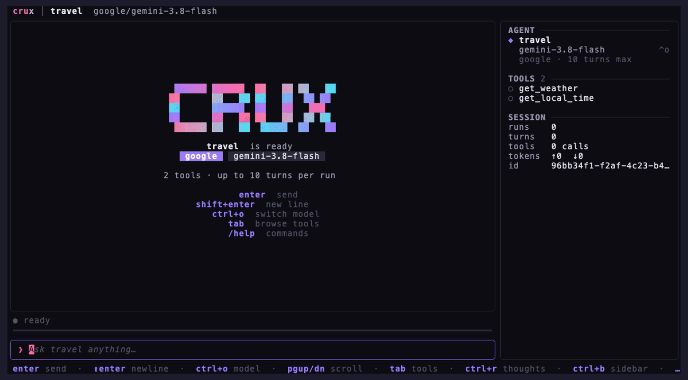

# crux

[](https://pkg.go.dev/crux.foo)

A small Go toolkit for building LLM agents that run the same way on every major provider.

- **Tools are plain Go functions.** The JSON schema comes from the input type.
- **One agent API for every provider:** OpenAI, Anthropic, Google Gemini, xAI, DeepSeek, OpenRouter and Ollama.
- **Sessions are replayable logs.** You can resume them, fork them (even onto another provider) and persist them.
- **One import.** Everything lives in the `crux` package. Pure Go, no cgo, and no database required.

> Status: `v0.0.x`. The API may still change between releases.



## Install

```sh
go get crux.foo
```

Requires Go 1.26+.

### Documentation

The [docs](docs/README.md) explain how crux is structured and works, with a
page per topic. They are written so coding agents can follow them too: point
your agent at [AGENTS.md](AGENTS.md) or the docs before it writes crux code,
since crux is newer than most models' training data.

## Quickstart

```go
package main

import (
	"context"
	"fmt"
	"log"

	"crux.foo"
)

type WeatherArgs struct {
	City string `json:"city" description:"City name, e.g. Paris"`
}

func getWeather(ctx context.Context, in WeatherArgs) (string, error) {
	return "Sunny, 22°C in " + in.City, nil
}

func init() {
	// Register once, anywhere in your program. Any agent can then use it by name.
	crux.RegisterTool("get_weather", "Get the current weather for a city", getWeather)
}

func main() {
	agent := crux.Must(crux.New("assistant", crux.ClaudeHaiku4_5,
		crux.WithInstructions("You are a helpful assistant."),
		crux.WithTools([]string{"get_weather"}),
	))

	ctx := context.Background()
	session := crux.MustSession(crux.NewSession(ctx, agent))

	answer, err := session.Run(ctx, "What's the weather in Paris?")
	if err != nil {
		log.Fatal(err)
	}
	fmt.Println(answer)
}
```

`Run` sends the input, executes every tool the model calls, sends the results back, and repeats until the model gives a final answer or `WithMaxTurns` (default 10) is reached.

No API key? Run the same agent on a local model with [Ollama](https://ollama.com): `ollama pull qwen3 && go run ./examples/ollama`.

### Chat in the terminal

`crux.CLI` opens a full-screen chat with any agent: answers stream in as rendered markdown, each tool call and subagent shows up as a live card, a sidebar on the right lists the agent's tools with call counts and token usage, and a progress bar follows each run from request to answer. Tools registered with `WithApprovalNeeded` ask for approval in a dialog, and `ctrl+o` (or `/model`) switches the model mid-conversation: the chat continues in a fork of the session on the new model, listing every provider that has an API key in the environment.

```go
crux.CLI(agent) // blocks until the user quits
```

Session options work too: `crux.CLI(agent, crux.WithStore(store), crux.WithSessionID(id))` reopens a stored conversation with its history.

## Concepts

| | |
|---|---|
| **Tool** | A Go function `func(ctx, In) (Out, error)` registered with `RegisterTool`. Tools live in a registry (the default one or your own `NewToolsRegistry`), not inside an agent, so any package can contribute tools. Registering a name twice panics. When the model calls several tools in one turn, they run concurrently (at most 8 at a time), so a tool must be safe to call from several goroutines; `WithSequential` runs a tool's calls in order instead. |
| **Agent** | An immutable blueprint: model, instructions, and the names of the tools it may use. It is safe to share across goroutines. |
| **Session** | One conversation with an agent. It holds an append-only log of entries (user input, assistant text, tool calls and results). It must not be used from multiple goroutines at once. |
| **Store** | Where a session's log is persisted. The default is in memory. |

## Features

### Images and files

Pass files to `Run`, `Stream` or `RunInto` next to text, in any order:

```go
answer, err := session.Run(ctx, "What's wrong with this chart?", crux.File("q3.png"))
```

| Source | Attachment |
|---|---|
| A path on disk | `crux.File("q3.png")` |
| An `fs.FS`, such as `embed.FS` | `crux.FileFS(assets, "prompts/style.pdf")` |
| Bytes | `crux.Data(b)` |
| An `io.Reader`, such as an upload | `crux.Reader(f).WithName(header.Filename)` |
| A URL the provider downloads | `crux.URL("https://example.com/cat.jpg")` |

crux detects the type from the content, or from the name for formats the content doesn't reveal (CSV, Markdown, ...); `WithName` and `WithMIME` set them when it can't. Images and PDFs go to the model as images and documents, and text files as inline text, on every provider. Files are read when `Run` starts, at most 20 MB each, and stored in the session log, so a resumed or forked session sends the same bytes.

### Structured output

```go
type Forecast struct {
	City    string `json:"city"`
	Summary string `json:"summary"`
}

agent := crux.Must(crux.New("forecaster", crux.OpenAIGPT5_4,
	crux.WithOutputSchemaFrom[Forecast](),
	crux.WithMaxRepairs(1), // ask the model to fix invalid output once
))

var forecast Forecast
err := session.RunInto(ctx, &forecast, "Describe a spring day in Paris.")
```

### Streaming

```go
for chunk, err := range session.Stream(ctx, "Write a haiku about Go.") {
	if err != nil {
		log.Fatal(err)
	}
	fmt.Print(chunk.Delta)
}
```

### Toolsets

A toolset registers a group of related tools in one call. Implement `Register`, label each tool with `WithToolset`, and add it with `AddToolset` (default registry) or `AddToolsetWithRegistry`. An agent then gets every tool in the set with `WithToolsets`:

```go
type mathTools struct{}

func (mathTools) Register(reg crux.ToolsRegistry) error {
	crux.RegisterToolWithRegistry(reg, "add", "Add two numbers", add, crux.WithToolset("math"))
	crux.RegisterToolWithRegistry(reg, "multiply", "Multiply two numbers", multiply, crux.WithToolset("math"))
	return nil
}

if err := crux.AddToolset(mathTools{}); err != nil {
	log.Fatal(err)
}
agent := crux.Must(crux.New("calc", crux.OpenAIGPT5_4,
	crux.WithTools([]string{"get_weather"}), // single tools
	crux.WithToolsets("math"),               // plus every tool in the "math" toolset
))
```

`WithTools` replaces the agent's tool list, so put `WithToolsets` after it. Use `WithToolsetsRegistry` with a custom registry.

### Tools with a runtime schema

When a tool's arguments are only known at run time, for example a tool of an MCP server, give its JSON Schema with `WithInputSchema` and take the arguments as `json.RawMessage` (or `map[string]any`). Arguments are still validated against the schema before the tool runs:

```go
crux.RegisterTool("docs_search", "Search the docs", func(ctx context.Context, args json.RawMessage) (string, error) {
	return mcpClient.CallTool(ctx, "search", args)
}, crux.WithInputSchema(schemaFromServer))
```

### MCP servers

`ConfigureMCP` connects to an [MCP](https://modelcontextprotocol.io) server, lists its tools and registers them as a toolset; agents use them with `WithMCPs`. Each tool is registered as `<server>_<tool>`, its arguments are validated against the server's schema, and it needs approval unless the server marks it read-only (`WithMCPApprovalNeeded` changes that).

```go
github, err := crux.ConfigureMCP(ctx, "github", crux.MCPRemote("https://api.githubcopilot.com/mcp/"))
defer github.Close()

files, err := crux.ConfigureMCP(ctx, "files",
	crux.MCPCommand("npx", "-y", "@modelcontextprotocol/server-filesystem", "./workspace"))
defer files.Close()

agent := crux.Must(crux.New("dev", crux.ClaudeSonnet5_5, crux.WithMCPs("github", "files")))
```

Authentication:

- **Local servers** (`MCPCommand`) get credentials from their environment: `WithMCPEnv("GITHUB_TOKEN=" + token)`.
- **API keys** for remote servers: `WithMCPHeader("Authorization", "Bearer "+key)`.
- **OAuth** needs no setup. When a remote server answers 401, crux finds its authorization server, registers itself as a client, opens the browser on the login page, receives the code on a loopback address (PKCE) and caches the token under the user's config directory. Later runs reuse and refresh it. Customise this with `WithMCPOAuth(crux.OAuthConfig{...})`: a pre-registered `ClientID`, `Scopes`, a fixed `RedirectURL`, your own `OpenURL`, or a `TokenStore` such as a database.

Tools are listed once, when the server is configured. Resources, prompts and sampling are not supported yet.

### Skills

A skill is a folder with a `SKILL.md`: YAML frontmatter with a `name` and a `description`, then markdown instructions, plus any files the instructions refer to (`references/`, `assets/`, …). It's the [Agent Skills](https://agentskills.io) format used by Claude, Codex and Google ADK. `AddSkills(dir)` registers the skills in `dir`; agents use them with `WithSkills`.

```go
if err := crux.AddSkills("./skills"); err != nil { // ./skills/<name>/SKILL.md
	log.Fatal(err)
}
agent := crux.Must(crux.New("assistant", crux.OpenAIGPT5_4, crux.WithSkills()))
```

Every request tells the model which skills exist (names and descriptions only); it loads the instructions of a skill it needs. Skills work the same on every provider.

| Tool | What it does | Approval |
|---|---|---|
| `load_skill` | a skill's instructions and the list of its other files | no |
| `load_skill_resource` | one of a skill's other files | no |
| `save_skill` | create a skill, or update one (replaces its `SKILL.md`, keeps other frontmatter fields and files) | yes |

The list of skills is read before each request, so a skill saved in one session is available to every session from its next request. Skill names are lowercase letters, digits and hyphens and must match their folder. `AddSkills` fails on an invalid skill; one that becomes invalid later is left out of the list. Scripts in a skill are not run.

### Filesystem tools

`Filesystem(root)` is a built-in toolset for reading and editing files under `root`. Nothing outside `root` can be reached (not through `..`, absolute paths or symlinks), paths use `/` on every OS, and it works the same on Linux, macOS and Windows. Tools that change files refuse paths that go through a symlink, so the change lands on the path that was approved.

```go
if err := crux.AddToolset(crux.Filesystem("./workspace")); err != nil {
	log.Fatal(err)
}
agent := crux.Must(crux.New("coder", crux.OpenAIGPT5_4, crux.WithToolsets("filesystem")))
```

| Tool | What it does | Approval |
|---|---|---|
| `read_file` | read a text file, optionally a line range | no |
| `read_multiple_files` | read several files at once | no |
| `list_directory` | list a directory | no |
| `directory_tree` | recursive tree, optional `max_depth` | no |
| `glob` | find files by pattern, e.g. `**/*.go` | no |
| `search_files_content` | text or regex search across files (queries up to 1 KB; a regex reads the first 32 KB of each line) | no |
| `write_file` | create or overwrite a file | yes |
| `edit_file` | replace exact, unique text in a file | yes |
| `create_directory` | create directories | yes |
| `remove_directory` | remove empty directories | yes |

If `root` has an `AGENTS.md`, it's added to the instructions of every request from an agent with any of these tools, so the agent follows the project's conventions as coding agents do. It's read before each request, so edits apply right away. Turn it off with `crux.Filesystem(root, crux.WithFilesystemAgentsFile(false))`.

Read-only tools run without approval, so the model can read any file under `root` (including `.env` files and keys) and its content is sent to the provider. Point `root` at the narrowest directory the agent needs. Each call is bounded (1 MB per file read, capped listings, walks and searches), and output that hits a limit ends with a note telling the model how to narrow the request. Writes and edits replace the file atomically.

### Network tools

`Network()` is a built-in toolset for working with the network, in pure Go and the same on Linux, macOS and Windows. Connections, listeners and servers stay open as handles (such as `tcp-1` or `http-4`) that the model sends on, reads from and closes; incoming data is buffered until it reads it.

```go
network := crux.Network()
defer network.Close() // closes everything still open
if err := crux.AddToolset(network); err != nil {
	log.Fatal(err)
}
agent := crux.Must(crux.New("netops", crux.Gemini3_8Flash, crux.WithToolsets(crux.ToolsetNetwork)))
```

| Tool | What it does | Approval |
|---|---|---|
| `dns_lookup` | DNS records like dig (A, AAAA, MX, TXT, SOA, SRV, PTR, CAA, HTTPS, …) with TTLs, from the system resolver or a given server | no |
| `whois` | registration data for a domain, IP or AS, following referrals from whois.iana.org | no |
| `http_get` | GET or HEAD a URL; reaches **public addresses only** | no |
| `http_request` | any method, headers and body, to any allowed host including local ones | yes |
| `net_connect` | open a `tcp`, `udp`, `tls`, `unix`, `unixgram`, `ws` or `wss` connection (TLS shows the certificate) | yes |
| `net_send` | send text, hex or base64 data on a connection | yes |
| `net_read` | read what arrived on a handle, waiting up to a timeout or for a delimiter | no |
| `net_listen` | accept TCP or unix connections, or UDP datagrams, on a port | yes |
| `http_serve` | serve fixed responses on a port and log every request | yes |
| `net_list`, `net_close` | show and close open handles | no |

Tools that send data the model chose or open a port need approval; change that with `WithNetworkApprovalNeeded`. `WithNetworkPrivate(false)` blocks loopback, private, link-local (including cloud metadata at 169.254.169.254) and CGNAT addresses, checked on the address actually dialed after DNS and on every redirect; `WithNetworkHosts("api.example.com", "*.internal", "10.0.0.0/8")` limits the tools to those hosts. A port alone (`:8080`) listens on 127.0.0.1, so nothing is exposed unless the model names an interface.

Data can leave through any query, including the names looked up with `dns_lookup` and `whois`, and anything read from the network goes into the model's context, so treat it as untrusted input. Each call is bounded (32 open handles, 1 MB buffered per handle, 30 s timeouts, response bodies cut at 64 KB by default), and idle handles close after 30 minutes.

### Tool approvals

```go
crux.RegisterTool("delete_file", "Delete a file", deleteFile, crux.WithApprovalNeeded(true))

_, err := session.Run(ctx, "Delete /tmp/cache.txt")
if errors.Is(err, crux.ErrApprovalNeeded) {
	for _, call := range session.PendingApprovals() {
		session.Approve(ctx, call.ID) // or session.Reject(ctx, call.ID, "reason")
	}
	answer, err = session.Resume(ctx)
}
```

### Tool timeouts

```go
crux.RegisterTool("fetch_report", "Fetch a report", fetchReport, crux.WithToolTimeout(30*time.Second))
```

When the time is up, the tool's context is cancelled and the model gets `tool "fetch_report" timed out after 30s` as the result, so the run goes on. A tool that ignores its context is left running in the background and its result is discarded.

### Tools whose order matters

When the model calls several tools in one turn, they run concurrently: the model hasn't seen any of their results yet, so none can depend on another's output. Side effects can still depend on order, such as creating a directory and then writing a file into it. Calls of a tool registered with `WithSequential` run one at a time, in the order the model wrote them, and each sees the state changes of the calls before it; calls of other tools still run alongside them.

```go
crux.RegisterTool("append_row", "Append a row to the sheet", appendRow, crux.WithSequential())
```

The filesystem tools and `net_send`, `net_read` and `net_close` are sequential already.

### Subagents

```go
researcher := crux.Must(crux.New("researcher", crux.OpenAIGPT5_4, crux.WithTools([]string{"search"})))
coordinator := crux.Must(crux.New("coordinator", crux.ClaudeSonnet5,
	crux.WithSubAgent(researcher, "Researches a topic and returns a brief"),
))
```

The coordinator sees a tool named `agent_researcher` that takes a `task` string.

If a subagent calls a tool that needs approval, the parent's `Run` returns `ErrApprovalNeeded` too. `PendingApprovals` lists the subagent's calls, with `Agent` set to the subagent's name, and `Approve`, `Reject` and `Resume` on the parent session continue the subagent where it stopped. This also works after the session is loaded again from a store.

### Spawning agents

`WithAgentSpawning` lets the model create agents itself: it gets a `spawn_agent` tool that takes a `name`, `instructions`, a `task` and the `tools` the new agent may use, and returns the agent's answer.

```go
coordinator := crux.Must(crux.New("coordinator", crux.ClaudeSonnet5,
	crux.WithTools([]string{"search", "fetch"}),
	crux.WithAgentSpawning(
		crux.WithSpawnModels(crux.ClaudeSonnet5, crux.ClaudeHaiku4_5), // the model may pick one; the first is the default
		crux.WithSpawnMaxTurns(5),
		crux.WithSpawnConcurrency(2), // at most two spawned agents run at once; the rest wait
	),
))
```

By default a spawned agent may use the parent's tools and model, with the parent's turn limit. `WithSpawnTools` (or `WithSpawnToolsRegistry`) sets the tools it may get instead, including ones the parent doesn't have. Spawned agents can't spawn agents themselves, and they run like subagents, so approvals work the same way.

### Persisting and resuming sessions

Sessions are kept in memory by default. To keep them, use any `crux.Store`. `crux.NewGORMStore` works with any GORM driver:

```go
import (
	"github.com/glebarez/sqlite" // pure Go; or gorm.io/driver/sqlite, postgres, ...
	"gorm.io/gorm"
)

db, _ := gorm.Open(sqlite.Open("crux.db"), &gorm.Config{})
store, _ := crux.NewGORMStore(db)

session, _ := crux.NewSession(ctx, agent, crux.WithStore(store))

// Later, possibly in another process: the same ID continues the conversation.
session, _ = crux.NewSession(ctx, agent, crux.WithStore(store), crux.WithSessionID(id))
```

The store is the source of truth: an entry joins the session only once the store has saved it. If a write fails, `Run` returns the error and the session is unchanged, so a tool whose result was not saved runs again on the next `Run` or `Resume`. Make tools with side effects idempotent.

If two `Session` values for the same ID write to one store (for example two requests for the same chat), the second write fails with `ErrSessionConflict`. Load the session again with `WithSessionID` and retry.

### Long conversations

Sessions stay within the model's context window on their own. When a request would pass 80% of the window, crux first omits large tool outputs and files the model has already read, and if that is not enough, the model summarises the older turns. A request the provider rejects as too long is compacted and sent again. The log keeps everything: a `KindCompaction` entry records what the model no longer sees in full.

```go
crux.New("agent", model,
	crux.WithCompaction(crux.CompactAt(0.7), crux.CompactWith(crux.ClaudeHaiku4_5)), // tune it
)
crux.New("agent", model, crux.WithoutCompaction())             // fail with ErrContextTooLong instead
crux.New("agent", "llama3.2", crux.WithProvider(crux.ProviderOllama),
	crux.WithContextWindow(32_000))                                // for models crux doesn't know

session.Compact(ctx) // summarise everything before the latest message now
```

In the terminal chat, `/compact` does the same.

### Reasoning

```go
agent := crux.Must(crux.New("planner", crux.ClaudeOpus4_8, crux.WithReasoning(crux.ReasoningHigh)))
```

`WithReasoning` takes `ReasoningOff`, `ReasoningLow`, `ReasoningMedium`, `ReasoningHigh` or `ReasoningMax` and maps it to each provider's setting (Anthropic adaptive thinking and effort, or a thinking budget before Claude 4.6; OpenAI reasoning effort; Gemini thinking level, or a budget on Gemini 2.5). Readable reasoning is requested where the provider offers it, so `Stream` yields `ChunkReasoning` chunks. Without the option, each provider uses its default.

### Tool choice

```go
agent := crux.Must(crux.New("extractor", crux.OpenAIGPT5_4,
	crux.WithTools([]string{"save_contact"}),
	crux.WithToolChoice(crux.ToolChoiceTool("save_contact")), // or ToolChoiceRequired, ToolChoiceNone
))
```

The choice applies to the first request after each new input. The requests that follow the tool results let the model decide again, so it can answer instead of calling tools until `WithMaxTurns`. `WithParallelToolCalls(false)` limits the model to one tool call per turn on every request; Gemini has no such setting and rejects it. Anthropic can't force a tool call while the model reasons, so `New` rejects `ToolChoiceRequired` or `ToolChoiceTool` together with `WithReasoning` other than `ReasoningOff`.

### Forking

```go
// Continue the same conversation on another provider.
forked, err := session.Fork(ctx, crux.WithModel(crux.Gemini3_8Flash), crux.WithProvider(crux.ProviderGoogle))
```

### Errors

`Run` returns sentinel errors you can check with `errors.Is`: `ErrApprovalNeeded`, `ErrMaxTurns`, `ErrRefused`, `ErrOutputValidation`, `ErrSessionConflict`, `ErrContextTooLong`. A tool that returns an error or panics does not stop the run, and neither do arguments that don't match the tool's input type. The error is sent to the model as the tool result so it can recover.

Failed provider requests (connection errors, timeouts, rate limits and server errors) are retried twice with backoff before `Run` returns the error. `WithMaxRetries(n)` changes that; `WithMaxRetries(0)` turns it off.

If `Run` fails after your input was recorded (a network error, say), retry with `Resume`. Calling `Run` again with the same input adds it to the conversation twice.

### Logging and tracing

Everything a run does is an entry in the session log: when it started and how it ended (`KindRunStarted`, `KindRunFinished`), each provider request (`KindTurnStarted`), each tool start and result, and token `Usage`. `WithEntryHandler` sees each entry as it is stored, including those of subagents, so logs, metrics and traces are a handler away:

```go
logEntries := crux.WithEntryHandler(func(ctx context.Context, s *crux.Session, e crux.Entry) {
	attrs := []any{"session", s.ID(), "agent", s.Agent().Name(), "seq", e.Seq}
	switch e.Kind {
	case crux.KindTurnStarted:
		slog.InfoContext(ctx, "model request", append(attrs, "model", e.Turn.Model)...)
	case crux.KindToolResult:
		if e.ToolResult.Error != "" {
			slog.WarnContext(ctx, "tool failed", append(attrs, "error", e.ToolResult.Error, "took", e.Duration)...)
		}
	case crux.KindRunFinished:
		slog.InfoContext(ctx, "run finished", append(attrs, "outcome", e.Run.Outcome, "error", e.Run.Error)...)
	}
	if e.Usage != nil {
		slog.InfoContext(ctx, "tokens", append(attrs, "input", e.Usage.InputTokens, "output", e.Usage.OutputTokens)...)
	}
})

session, err := crux.NewSession(ctx, agent, logEntries)
```

For OpenTelemetry, start a span on `KindRunStarted` and end it on `KindRunFinished`, with a child span from each `KindTurnStarted` to the response's last entry (it carries `Response`). [`examples/lifecycle`](examples/lifecycle) traces a run live and rebuilds a summary of each run from the stored log.

## Providers

The provider is inferred from known model constants (`crux.ClaudeSonnet5`, `crux.OpenAIGPT5_4`, `crux.Gemini3_8Flash`, …). For any other model ID, pass `crux.WithProvider`.

| Provider | `Provider` | API key environment variable | Web search |
|---|---|---|---|
| OpenAI | `ProviderOpenAI` | `OPENAI_API_KEY` | ✓ |
| Anthropic | `ProviderAnthropic` | `ANTHROPIC_API_KEY` | ✓ |
| Google Gemini | `ProviderGoogle` | `GOOGLE_API_KEY` or `GEMINI_API_KEY` | ✓ |
| xAI | `ProviderXAI` | `XAI_API_KEY` | ✓ |
| DeepSeek | `ProviderDeepSeek` | `DEEPSEEK_API_KEY` | – |
| OpenRouter | `ProviderOpenrouter` | `OPENROUTER_API_KEY` | – |
| Ollama | `ProviderOllama` | none needed locally (`http://localhost:11434/v1`) | with `OLLAMA_API_KEY` |

Anthropic requests cache the prompt automatically, so each turn of a run reads the conversation so far from the cache instead of paying for it again.

Common agent options: `WithInstructions`, `WithTools`, `WithToolsets`, `WithMaxTurns`, `WithMaxTokens`, `WithTemperature`, `WithReasoning`, `WithToolChoice`, `WithParallelToolCalls`, `WithOutputSchemaFrom`, `WithWebSearch`, `WithAPIKey`, `WithBaseURL`, `WithMaxRetries`. The HTTP client is a session option, `crux.WithHTTPClient(client)`, inherited by subagent sessions.

## Testing your agents

`cruxtest` is a mock HTTP transport that speaks each provider's wire format, so you can test your real agents without network calls or keys. Hand the mock's client to the session:

```go
mock := cruxtest.NewMock()
mock.Expect().ReturnToolCall("get_weather", map[string]any{"city": "Paris"})
mock.Expect().ReturnText("It's sunny in Paris.")

session, _ := crux.NewSession(ctx, assistant, crux.WithHTTPClient(mock.Client()))
answer, _ := session.Run(ctx, "Weather in Paris?")
```

See [docs/testing.md](docs/testing.md) for testing an application's agents.

## Examples

See [`examples/`](examples): `ollama` (the quickstart on a local model, no API key), `basic` (multi-tool planner with structured output), `attachments` (an embedded CSV, a chart drawn in memory, files from the command line and HTTP uploads), `stream`, `store`, `fork`, `subagents`, `spawning` (an assistant with no instructions whose only tool creates agents, and which works out the rest itself), `websearch`, `filesystem`, `skills` (a terminal chat with a commit-message skill that can save new skills), `lifecycle` (live trace with WithEntryHandler, approvals, per-run summary from the log), `cli` (a coding agent in the terminal chat), `mcp` (chat about your Linear issues through Linear's MCP server, with OAuth login), `network` (a network assistant with DNS, whois, HTTP, sockets and servers), `domains` (a terminal chat that proposes available domain names for an idea, checked by the network toolset with RDAP and whois), `oncall` (an on-call engineer with an investigator subagent and approved rollbacks, in the terminal chat).

## Development

```sh
go test ./...                      # unit tests, no network
go test -tags evals ./evals/...    # live evaluations; needs provider API keys
```

See [CONTRIBUTING.md](CONTRIBUTING.md) before opening a pull request, and [SECURITY.md](SECURITY.md) to report a vulnerability.

## License

[Apache 2.0](LICENSE)
